<h2> Bye sbb 👋, Hello Guest! ✋ </h2>
<br>
<br>
An eHealth DevOps Presentation
<br>
by
<br>
Harsha Bharadwaj

---

# What?

Note:

1. A new, completely re-designed, built from ground-up, no reuse version of 'sbb'
2. Exact replacement for now
3. Plans to be much more in future

---

# Why?

Note:

1. sbb's design started showing limitations
2. new features became patchy and led to spaghetti code
3. It satified all functional reqs but did not satisfy 'Modifiability' - could not be mended easily
4. we had time pressure to move to something better quickly
5. Why not refactor? We assessed re-write is easier than refactor

---

## Backward Compatibility

Note:

1. only until v1.0.0
2. v2.0.0 plans to have breaking changes

---

## Forward Compatibility

Note:

1. this is important than backward compatibility
2. metadata schema is forward compatible
3. carefully designed interfaces that is future proof

---

<br>
<br>
<br>
<br>
# DoCity

<section
  data-background="linear-gradient(rgba(0, 0, 0, 0.65), rgba(0, 0, 0, 0.65)), url(assets/images/cityscape.png)"
  data-background-size="contain"
></section>

---

<br>
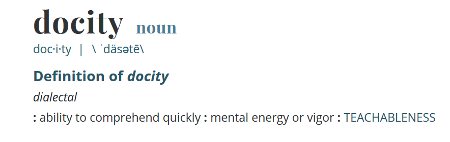 

Note:

1. Anyone can open up the repo and fix issues quick than logging on
2. Can be 'mend' in many ways - both planned and unplanned
3. needed a new name because sbb was overloaded
4. new name suits because it's a completely new product and plans to co-exisit with sbb for sometime

---

# DoCI

---

# System Design

---

## Function
<br>
<br>
<section>
    <div class='multiCol'>
        <div class='col'>
            <h2> sbb </h2>
        </div>
        <div class='col'>
            <h2> DoCity </h2>
        </div>
    </div>
    <br>
    <br>
    <div class='multiCol'>
        <div class='col'>
            <h3> Build Tool </h3>
        </div>
        <div class='col'>
            <h3> CI/CD<sup>2</sup> System </h3>
        </div>
    </div>    
</section>

---

## Architecture
<br>
<br>
<section>
    <div class='multiCol'>
        <div class='col'>
            <h2> sbb </h2>
        </div>
        <div class='col'>
            <h2> DoCity </h2>
        </div>
    </div>
    <br>
    <br>
    <div class='multiCol'>
        <div class='col'>
            <h3> BBoM/CF </h3>
        </div>
        <div class='col'>
            <h3> Modular </h3>
        </div>
    </div>    
</section>

---

## Interfaces
<br>
<h2> sbb </h2>
<ul> 
<li> Interactive CLI </li>
<li> Parameterized CLI </li>
</ul>

---

## Interfaces
<br>
<h2> DoCity </h2>
<ul>    
    <li> Interactive CLI </li>
    <li> Parameterized CLI </li>
        <ul>
            <li> Global </li>
            <li> Per Module </li>
        </ul>
    <li> SDK </li>
    <li> Gulp </li>
</ul>

---

## Metadata File
<br>
<br>
<section>
    <div class='multiCol'>
        <div class='col'>
            <h2> sbb </h2>
        </div>
        <div class='col'>
            <h2> DoCity </h2>
        </div>
    </div>
    <br>
    <br>
    <div class='multiCol'>
        <div class='col'>
            <h3> build.yaml </h3>
        </div>
        <div class='col'>
            <h3> do.yaml </h3>
        </div>
    </div>    
</section>

---

## Abstraction Changes
<br>
<br>
<br>
<br>
<section>
    <div class='multiCol'>
        <div class='col'>
            <h2> sbb </h2>
        </div>
        <div class='col'>
            <h2> DoCity </h2>
        </div>
    </div>
    <div class='multiCol'>
        <div class='col'>
            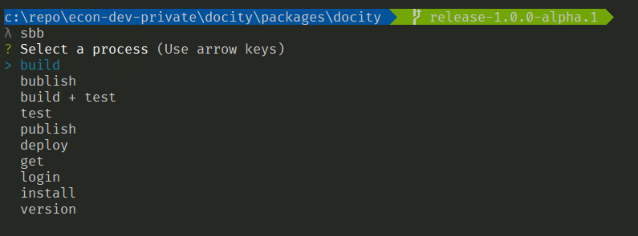 
        </div>
        <div class='col'>
            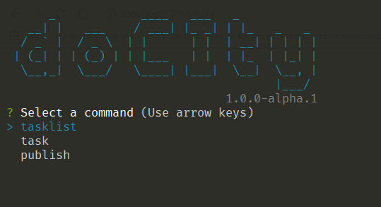 
        </div>
    </div>   
</section>

---

## Tasklist

```yaml
default:
  tasks:
    - copyJS
    - copyCcl
    - createInstaller
    - copyPackageJson
    - replaceVersion
    - copySettingsJS
    - versionizeCCL
    - copyReleaseNotes
    - appendReleaseNotesMetadata
```

Note:

1. Can have as many tasklists per metadata file
2. 'default' is the default tasklist that's run

---

## Task

```yaml
copyJS:
  type: sbb-copyfile
  src:
    project:
      - entity-store-build.js
  dest:
    output:
      - nswsbb-entity-store/js
```

Note:

1. Can have as many tasks per metadata file in any combination in any tasklist
2. now the ability to run task directly

---

## Pipelines

```yaml
default:
  tasks:
    - build
    - test
    - publish
    - deploy
```

---

## Reference Systems
<br>
<br>
<section>
<div class='multiCol'>
        <div class='col'>
              
        </div>
        <div class='col'>
             
        </div>
        <div class='col'>
              
        </div>
    </div>   
</section> 

---

## Reference Books
<br>
<br>
<section>
<div class='multiCol'>
        <div class='col'>
            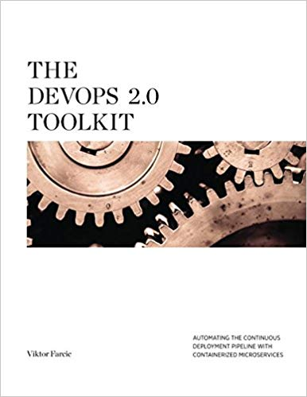 
        </div>
        <div class='col'>
             
        </div>
        <div class='col'>
             
        </div>
    </div>   
</section> 

---

## Installation
<br>
<br>
<br>
<br>
<section>
    <div class='multiCol'>
        <div class='col'>
            <h2> sbb </h2>
        </div>
        <div class='col'>
            <h2> DoCity </h2>
        </div>
    </div>
    <div class='multiCol'>
        <div class='col'>
            ```npm install -g @econ/sbb``` 
        </div>
        <div class='col'>
            ```npm install -g @econ/docity``` 
        </div>
    </div>    
</section>

---

## Monorepo
<br>
<br>
<section>
    <div class='multiCol'>
        <div class='col'>
            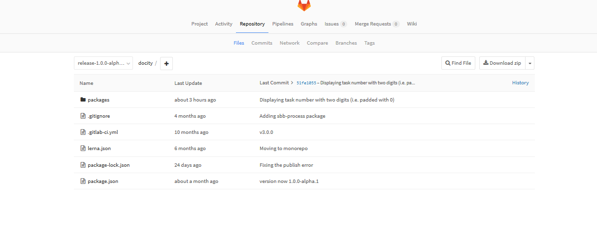 
        </div>
        <div class='col'>
            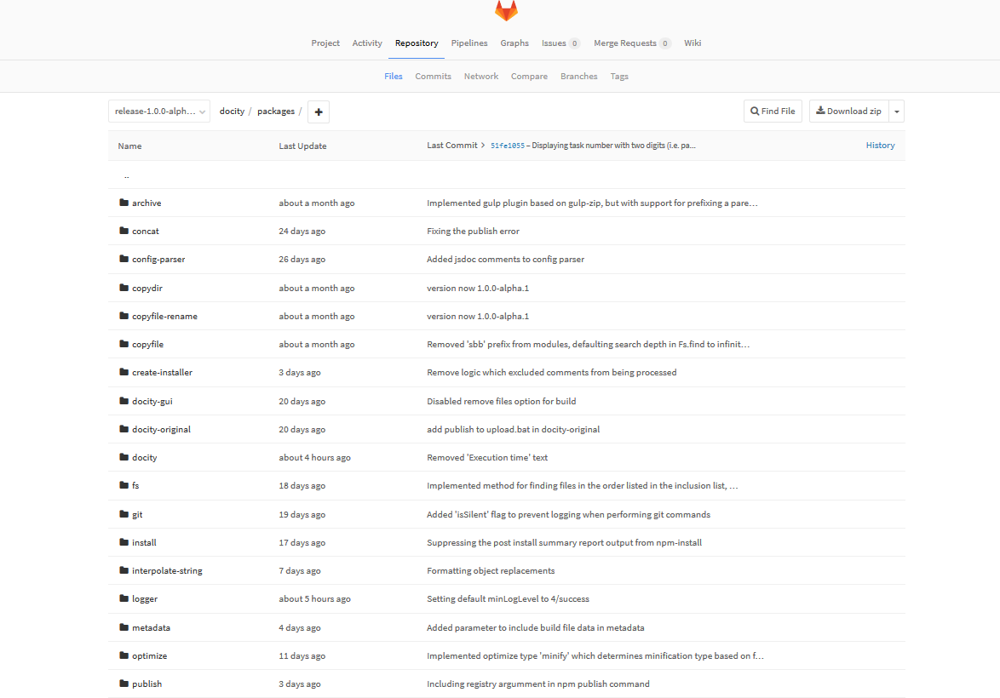
        </div>
    </div>
</section>

---

# Demo

---

## Documentation

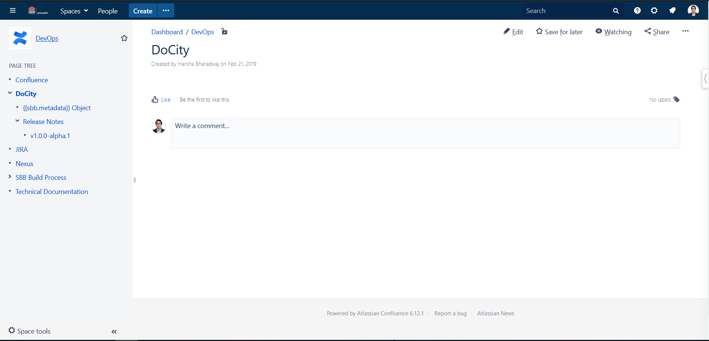

--

## Release Notes

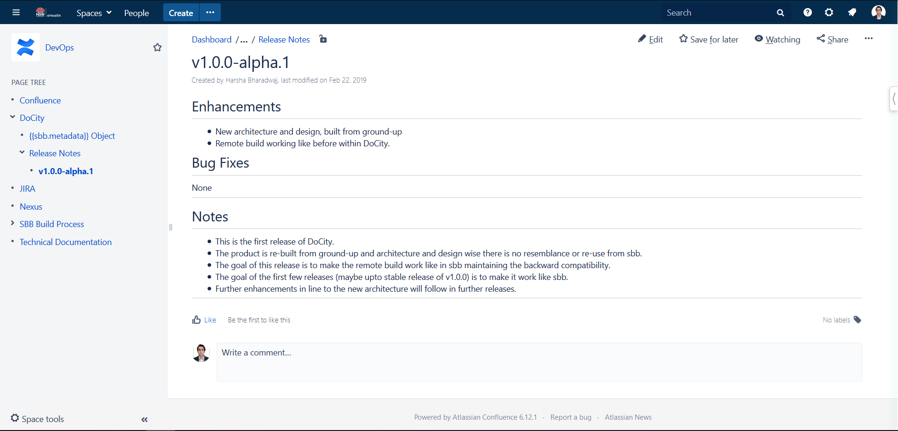 

---

## Support

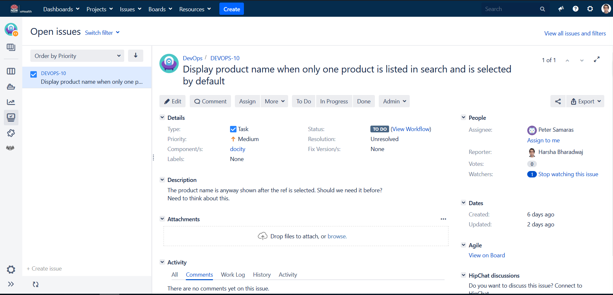 

--

## Component

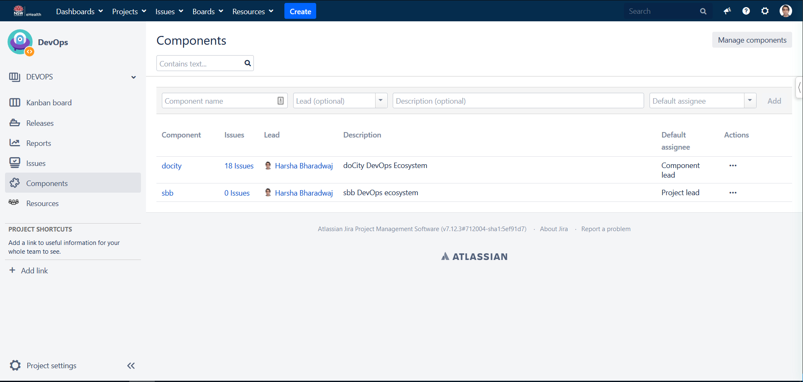 

--

## Releases

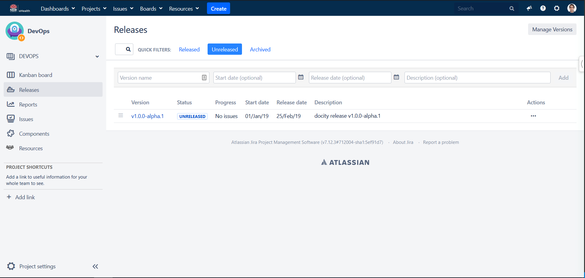

Note:

1. Idea is to release often and release early

---

## Future Development
<br>
<br>
1. Local build in next immediate release
2. Development time changes
3. Move away from file I/O to stream I/O
4. Integrate with Gitlab CI

---

# Lessons Learnt

--

## Avoid Modifying Third Party Libraries

Note:

	1. consuming as is vs. modifying before consuming
		1. think of monitoring the changes - design, bug fixes, versions
		2. think of consuming new versions - how to merge your old change to the new version - understand their code and design?
		3. how do you name and version it?
			1. if other dependency uses original version it causes issues
	2. alternatives
		1. submit issue/PR to the moderator
		2. use a workaround until its fixed
		3. clone and use - bad option
		4. use modification as the last resort


--

## Right Intention Doesn't Automatically Lead to Right Output

Note:

1. Design is so vital
2. Non functional requirements needs to be taken care of

--

## Keep up-to-date with changes

Note:

1. Grunt vs. Gulp

--

## Move to Modern JS

Note:

1. Can't emphasize enough how important ES6 modules, avoiding callbacks, using classes etc are

--

## Unit testing helps

---

## Thank You!!
<br>
<br>
That's all for today


